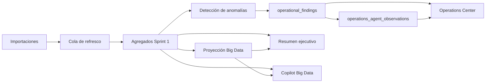

# Validación controlada — Big Data Sprint 2

Fecha: 2026-07-24  
Ámbito: Mall Demo (`ce12312e-220d-4200-aa36-a959bf7d271c`)  
Estado del PR: **borrador; no listo para merge ni activación comercial**.

## Alcance y protección

- La migración Sprint 2 fue aplicada de forma aditiva y no reconstruyó datos existentes.
- Las capacidades se habilitaron únicamente para Mall Demo. La ausencia de un flag sigue significando desactivado para los demás malls.
- No se ejecutaron migraciones masivas, reconstrucciones globales ni cambios de RLS Legacy.
- Se mantuvieron las importaciones como carril prioritario del worker.

## Evidencia funcional

| Control | Resultado real |
| --- | --- |
| Panel Big Data | Cargó ventas netas de `$3,260.32`, 6 registros y ranking para Mall Demo. |
| Proyección | Cobertura `4.2%`; devolvió `INSUFFICIENT_DATA`, sin inventar cierre mensual. |
| Resumen ejecutivo | Marcó el período como incompleto y conservó métricas estructuradas. |
| Operations Center | Mostró el hallazgo real `DATA_INCOMPLETE`, severidad `HIGH`, con explicación de que no se concluye una caída comercial. |
| Observaciones | Registró una observación determinística: la calidad debe validarse antes de emitir una conclusión comercial. |
| Copilot Big Data | Para “¿Cómo van las ventas este mes?” devolvió acumulado `$3,260.32`, 1 día con datos, cobertura `4.17%` y estado `DATA_INCOMPLETE`. |
| Multi-mall | El selector conserva Mall Demo y el panel se recarga sin conservar datos del mall previo. |

## Worker, idempotencia y rendimiento observado

Dos ejecuciones reales de `ANOMALY_DETECTION` para el período 2026-06-24 a 2026-07-24 completaron correctamente:

| Ejecución | Duración | Elementos reportados |
| --- | ---: | ---: |
| 2026-07-24 23:06 UTC | 376 ms | 1 |
| 2026-07-24 23:11 UTC | 343 ms | 1 |

Las dos ejecuciones conservaron un único hallazgo con fingerprint
`0740f3d6861e6735dc2b2657df645806e24fd1160f57dc80b29b4e1a2923e55d`.
No hubo duplicación de hallazgos.

El hallazgo fue marcado como revisado y se comprobó la acción de resolución. Fue restituido a `OPEN` porque la falta de cobertura todavía es real; no debe quedar resuelto artificialmente después de la prueba.

## Corrección aplicada durante la validación

La frase “¿Cómo van las ventas este mes?” usaba el contexto Legacy. Se corrigió en `a473e22` para dirigir consultas mensuales de ventas al contexto Big Data. La prueba automatizada correspondiente pasó (`8 passed`). Tras el despliegue, el Copilot indicó cobertura, período y datos incompletos.

## Riesgos y requisitos obligatorios antes de activación comercial

1. Ejecutar paridad numérica contra datos reales para malls alto, medio y bajo volumen, por mall/local/categoría y día/mes.
2. Confirmar la semántica comercial final de transacción antes de presentar ticket promedio como transacciones comerciales.
3. Medir benchmark de importación con y sin trigger/encolado y documentar bloqueos, cola y duración.
4. Ejecutar prueba de concurrencia real con dos workers y recuperación de trabajo abandonado.
5. Reunir evidencia visual adicional de estado vacío, período incompleto, cambio rápido de mall, perfil 360° y resolución compacta de escritorio.
6. Mantener los flags de Sprint 2 desactivados para todos los malls fuera de Mall Demo hasta completar los controles anteriores.

## Despliegue y rollback

- Despliegue de API validado: Railway `b2d2b7a8-28e8-4f93-ae5f-d60dabac77cc`.
- Rollback funcional inmediato: desactivar `BIG_DATA_COPILOT`, `BIG_DATA_OPERATIONS`, `BIG_DATA_FORECAST` y `BIG_DATA_CORE` únicamente para Mall Demo.
- Rollback de código: revertir el commit `a473e22` en la rama, desplegar la revisión anterior y conservar las capacidades apagadas.

## Arquitectura

