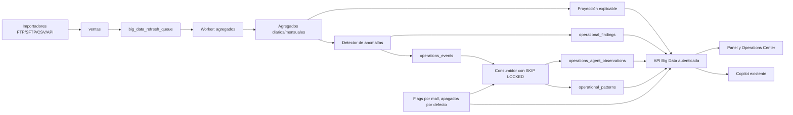

# MSMALL Big Data Sprint 2 — implementación

## Resultado ejecutivo

Sprint 2 agrega proyecciones explicables, anomalías determinísticas,
observaciones operativas, Operations Center, resumen ejecutivo y contexto
analítico para el Copilot. La proyección Legacy de `analytics.py`, Finanzas,
dashboards y reportes no fue modificada.

Las capacidades nuevas requieren `BIG_DATA_CORE` y su flag específico. La
migración no inserta flags ni los habilita para ningún mall.

## Modelo oficial

| Concepto | Fuente | Mutabilidad y atención |
| --- | --- | --- |
| Evento | `operations_events` | Hecho inmutable; solo cambia su estado de procesamiento |
| Hallazgo/anomalía | `operational_findings` | Atendible, revisable, resoluble y reabrible |
| Observación | `operations_agent_observations` | Explicación determinística trazable |
| Patrón | `operational_patterns` | Recurrencia histórica |
| Alerta | `alertas_inteligentes` | Canal Legacy de presentación/notificación |
| Proyección | `BigDataSprint2Service` | Cálculo independiente sobre agregados |

Los hallazgos y eventos analíticos usan un `fingerprint` estable. Los reclamos
del worker se realizan con `FOR UPDATE SKIP LOCKED`, token de propietario y
recuperación de trabajos abandonados.

## Proyección Big Data

`services/big_data_sprint2_service.py` aplica un promedio por día de semana:

- usa agregados diarios del Sprint 1;
- combina historia y comportamiento del mes actual;
- informa acumulado, días observados y restantes;
- devuelve rango inferior/superior mediante residuos históricos;
- compara contra mes anterior y año anterior;
- devuelve cobertura, metodología, historial, versión y razones de baja
  confianza;
- responde `INSUFFICIENT_DATA` para historia insuficiente;
- soporta mall, categoría y local.

Versión: `big-data-forecast-v1`.

## Reglas de anomalías

Versión: `big-data-anomaly-v1`.

1. `UNUSUAL_DROP`
2. `UNUSUAL_INCREASE`
3. `ZERO_ACTIVITY`
4. `CONSECUTIVE_BELOW_EXPECTED`
5. `CATEGORY_DEVIATION`
6. `DATA_INCOMPLETE`
7. `RECORD_COUNT_SHIFT`
8. `DATA_INCOMPLETE` con evidencia de importación fallida
9. `ATYPICAL_NEGATIVE`
10. `DAILY_MONTHLY_TREND_GAP`

Cuando cobertura o importaciones son insuficientes, el detector emite primero
`DATA_INCOMPLETE` y no afirma una caída comercial. Si una corrección elimina la
condición, el hallazgo del mismo período se resuelve con
`DATA_CORRECTED_OR_CONDITION_CLEARED`.

## Contratos

El router `/api/v1/big-data` expone:

- `/forecast/mall`
- `/forecast/categories`
- `/forecast/stores/{local_id}`
- `/executive-summary`
- `/operations/items/{events|findings|anomalies|observations|patterns}`
- `/operations/status`
- acciones `/review`, `/resolve`, `/reopen` y `/comments`
- `/copilot-context`

Todos autentican, validan acceso al mall, requieren `BIG_DATA_CORE`, validan el
flag específico, limitan rangos/paginación y auditan cambios de estado.

## Worker y rendimiento

Orden del ciclo:

1. importaciones;
2. agregados Big Data;
3. detección de anomalías;
4. observaciones;
5. patrones.

Los límites son 50 fechas de refresh, 100 malls habilitados, 25 eventos por
reclamo, 200 categorías y 500 locales por ejecución. Cada job operacional
registra mall, período, duración, intentos, resultado, error y elementos
generados en `big_data_operations_runs`.

No se ejecutó benchmark productivo ni se aplicó la migración durante el
desarrollo. El rendimiento real con volumen representativo queda como control
obligatorio antes de activar comercialmente.

## Pruebas y regresión

- `python3 -m pytest -q tests`: **117 passed**.
- Pruebas dirigidas Sprint 1/Sprint 2: **22 passed**.
- `npm run build`: correcto; solo permanece el warning histórico de chunk mayor
  de 500 kB.
- `python3 -m py_compile`: correcto.

El `pytest` sin limitar el directorio intenta importar
`test_mapping_endpoint.py`, un script histórico que ejecuta una llamada a
`localhost:8000` durante la colección. Por eso la regresión automatizada se
ejecuta sobre `tests/`.

La migración contiene la estrategia PostgreSQL de dos workers, recuperación por
timeout y protección por claim token. La prueba real contra dos conexiones
PostgreSQL requiere aplicar la migración en un entorno integrado; no se ejecutó
contra producción.

## Despliegue controlado

1. Mantener los cuatro flags apagados.
2. Respaldar las tablas operacionales.
3. Verificar que no existan duplicados de `(mall_id, fingerprint)` antes de
   crear los índices únicos.
4. Aplicar `20260724_big_data_sprint_2.sql` en un ambiente controlado.
5. Desplegar backend y worker.
6. Ejecutar smoke de importación Legacy con flags apagados.
7. Activar, en un único mall piloto y en este orden:
   `BIG_DATA_CORE`, `BIG_DATA_FORECAST`, `BIG_DATA_OPERATIONS`,
   `BIG_DATA_COPILOT`.
8. Ejecutar concurrencia real, benchmark y validación visual.
9. Solo después considerar activación comercial.

## Rollback

1. Desactivar `BIG_DATA_COPILOT`, `BIG_DATA_OPERATIONS` y
   `BIG_DATA_FORECAST`; si es necesario, desactivar también `BIG_DATA_CORE`.
2. Revertir el despliegue de backend/worker al commit anterior.
3. No borrar eventos, hallazgos u observaciones: son evidencia auditable.
4. Si fuera indispensable revertir esquema, eliminar primero la función
   `claim_operations_events`, luego los índices y columnas aditivas. Conservar
   una copia de `big_data_operations_runs`.
5. Si falla un merge, revertir el merge commit; nunca hacer push directo a
   `main`.

## Riesgos pendientes

- Falta prueba real con dos conexiones PostgreSQL después de aplicar la
  migración.
- Falta benchmark con volumen representativo.
- Falta evidencia visual autenticada con flags activados en un ambiente
  integrado.
- Las metas comerciales no tienen una fuente oficial disponible; el contrato
  devuelve cumplimiento solo cuando se proporcione una meta válida.
- La migración fallará de forma segura si existen fingerprints duplicados; debe
  ejecutarse el preflight.
- El bundle frontend conserva el warning Legacy de tamaño de chunk.

Por estos riesgos, el PR debe permanecer en borrador y no está listo para
merge.

## Arquitectura

